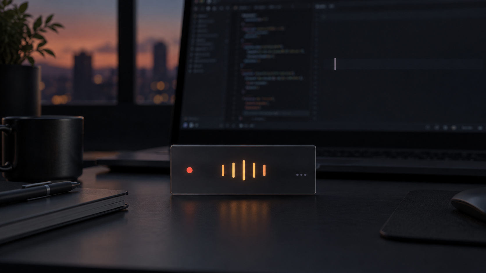

# `speak`

<p align="center">
  
</p>

> **Your voice is the new keyboard.** macOS-native, 100% local, free, open-source
> voice dictation and developer agent interface — speech → on-device AI neat-writing → pasted at cursor.

[](https://github.com/ArasanDev/speak/actions/workflows/ci.yml)
[-lightgrey)](#quick-start)
[-black)](#installation)
[](#tech-stack)
[](LICENSE)
[](#privacy--the-7-point-moat)
[-brightgreen)](#privacy--the-7-point-moat)

---

`speak` is a lightweight macOS menubar application engineered for developers and power users.
Press a hotkey, speak naturally, and stop. An on-device 3B Foundation Model **writes your transcript neatly** — removing filler words, fixing grammar and punctuation, and preserving code terms — then pastes the finished text directly at your cursor in any application.

No cloud. No monthly subscriptions. No accounts. No audio egress. Fully functional offline.

It delivers the magic of Wispr Flow ($15/mo, cloud-only) and Superwhisper ($8/mo), built entirely on Apple Silicon native frameworks with zero third-party runtime dependencies.

---

## The 4 Core Problems We Solve

Existing voice tools either compromise user privacy for cloud AI, produce raw rambling text, break across hardware devices, or ignore developer workflows. `speak` was built from the ground up to solve these four fundamental friction points:

### 1. Privacy Invasion & Subscription Creep in Voice Dictation
* **The Problem**: Mainstream commercial voice apps (Wispr Flow, etc.) charge $15+/month, stream private audio to remote cloud servers, take periodic background screenshots of your active windows, and require user accounts. Your private speech, confidential client code, and system context leave your machine.
* **Our Solution**: **100% Local by Architecture**. Speech transcription uses Apple's native `SpeechAnalyzer`, and neat-writing runs on Apple's on-device Foundation Models. Zero telemetry, zero external network egress, zero accounts, write-only pasteboard (never reads clipboard history), and MIT-licensed free forever.

### 2. Dictation Latency, Hallucinations & Over-Editing
* **The Problem**: Raw speech-to-text dumps unpunctuated, rambling streams filled with *"um"*, *"uh"*, and false starts. Conversely, piping dictation into generic cloud LLMs causes 5–10 second response lags, hallucinated answers to questions instead of transcribing them, and destructive paraphrasing of your exact words.
* **Our Solution**: **Progressive Continuous Streaming & Guarded AI Polish**. A 5-line continuous FIFO overlay displays live partial transcriptions as you speak. When completed, Apple's 3B Foundation Model cleans the text using strict imperative system guardrails (`@Generable` clause-level cleaning, zero question-answering, and verbatim preservation of technical syntax and developer jargon).

### 3. Audio Hardware Inflexibility & Headphone Dropouts
* **The Problem**: CoreAudio on macOS frequently glitches or fails to record when connecting or disconnecting AirPods, Bluetooth headsets (Bluetooth SCO 16kHz/24kHz mono negotiation vs. 48kHz built-in mic), or USB audio interfaces. Stale OS permissions can also silently freeze hotkey taps.
* **Our Solution**: **24/7 CoreAudio HAL Monitoring & Instant Self-Healing**. A dedicated CoreAudio HAL hardware monitor detects default input device changes instantaneously, applies dynamic device pinning, and uses 3-attempt exponential backoff settling for Bluetooth SCO format handshakes. If macOS permissions ever desynchronize, the built-in **"↻ Re-check & Re-arm"** button restores system taps in one click.

### 4. Developer & AI Coding Agent Workflow Friction
* **The Problem**: Traditional dictation tools treat voice as generic prose. They butcher code syntax, camelCase, Git flags, CLI commands, and have zero connectivity with autonomous coding agents (Claude Code, Cursor, Codex).
* **Our Solution**: **Agent-Native Voice Interface**. Built with developer vocabulary biasing, prompt-tag awareness (`[speak-stt]`, `[voice-stt]`, `:clean`, `:raw`), and a compiled Swift **`speak-mcp`** (Model Context Protocol) stdio bridge that allows coding agents to request spoken human feedback, send notifications, and receive structured approvals.

---

## How It Compares

| Feature | Wispr Flow | Superwhisper | MacWhisper | **speak** |
|:---|:---|:---|:---|:---|
| **Price** | $15 / month | $8 / month | Free / $39 Pro | **Free forever (MIT)** |
| **Architecture** | Cloud-only | Local-first | Local-first | **100% Native Local** |
| **Model Download Size** | 0 MB (cloud) | 500 MB – 3 GB | 1 GB – 5 GB | **< 15 MB** (uses macOS built-ins) |
| **Privacy & Telemetry** | Cloud audio + screenshots | Local storage | Local storage | **Zero network egress, 2 perms** |
| **AI Neat-Writing** | Cloud LLM | Local LLM / Cloud | None | **On-device Apple Foundation Models** |
| **Pasteboard Security** | Reads clipboard | Reads clipboard | Reads clipboard | **Write-only (macOS paste-safe)** |
| **Hardware Resilience** | Generic | Occasional disconnects | Occasional disconnects | **Dynamic CoreAudio HAL auto-healing** |
| **Agent Bridge (MCP)** | None | None | None | **Native Swift `speak-mcp`** |
| **Open Source** | Closed | Closed | Closed | **MIT Licensed** |

---

## Installation

> **Status: alpha.** Actively developed; expect rough edges. Local-first means
> exactly that — the app validates on your machine, not ours.

Requirements: **macOS 26+ (Tahoe)**, **Apple Silicon M5** (primary target; **M4** supported — it runs macOS 26). Not sure? Run `make compat` — a read-only one-shot check of chip, OS, and toolchain.

### Option 1: Homebrew Cask (Recommended for macOS Users)

Install via Homebrew:

```bash
# Install directly via Cask:
brew install --cask speak

# Or install from local repo cask:
brew install --cask dist/speak.cask.rb
```

### Option 2: Standalone DMG (Drag-and-Drop)

1. Download the latest `Speak.dmg` from [Releases](https://github.com/ArasanDev/speak/releases) (or generate locally with `make dmg`).
2. Open `Speak.dmg` and drag `Speak.app` into your `/Applications` folder.
3. Launch Speak from Spotlight or Launchpad.

### Option 3: One-Line Install Script (Build & Install from Source)

Builds directly from source on your Apple Silicon Mac, ad-hoc signs, installs to `/Applications`, and clears Gatekeeper quarantine flags automatically:

```bash
curl -fsSL https://raw.githubusercontent.com/ArasanDev/speak/master/scripts/install.sh | bash
```

### Option 4: Developer Build from Source

```bash
# Install toolchain prerequisites:
brew install xcodegen swiftlint xcbeautify

# Clone and build:
git clone https://github.com/ArasanDev/speak.git && cd speak
make build     # Generates Speak.xcodeproj and compiles Speak.app
make test      # Runs the full XCTest test suite
make run       # Launches the menubar application
```

---

## First-Time Setup & Permissions

When launching Speak for the first time, macOS requires two permissions:

| Permission | Why It Is Required |
|:---|:---|
| **Microphone** | Captures audio for on-device speech-to-text (`SpeechAnalyzer`). Audio is never written to disk or sent to the cloud. |
| **Accessibility** | Enables the global `Fn` double-tap hotkey detector (`CGEventTap`) and allows synthetic `Cmd+V` pasting into active apps. |

> **Strict Moat Guarantee**: Speak **never** asks for or uses *Input Monitoring*, *Screen Recording*, or *Full Disk Access*.

### Launch at Login
To keep Speak running seamlessly in your menubar:
- Open **Speak Settings** (via menubar icon or `Cmd+,`) → **General** → toggle **Launch at Login** ON.
- Or configure directly in macOS **System Settings** → **General** → **Login Items**.

---

## Friction-Free Self-Healing & Troubleshooting

We engineered Speak to minimize friction and self-repair edge cases without requiring system restarts.

### 1. In-App One-Click Repair: "↻ Re-check & Re-arm Hotkey Tap"
* **The Symptom**: You enabled Accessibility in macOS System Settings, or rebuilt the app, but double-tapping `Fn` does not trigger dictation.
* **Why it happens**: macOS TCC (Transparency, Consent, and Control) occasionally caches stale permissions or loses track of updated ad-hoc binary signatures.
* **The Instant Fix**:
  - **From Menubar**: Right-click the Speak menubar icon and click **"↻ Re-check & Re-arm Hotkey Tap"**.
  - **From Settings**: Open **Settings** → **Hotkey & Input** → click **"↻ Re-check & Re-arm Hotkey Tap"**.
  - Speak will re-validate `AXIsProcessTrusted()`, re-initialize the `CGEventTap` stream, and restore hotkey listening immediately.

### 2. Apple System Dictation Shortcut Conflict
* **The Symptom**: Double-tapping `Fn` triggers Apple's default Siri/system dictation prompt instead of Speak.
* **The Fix**:
  1. Open macOS **System Settings** → **Keyboard**.
  2. Under the **Dictation** section, find **Shortcut**.
  3. Change the shortcut from *"Press Fn (Function) Key Twice"* to **"Off"** (or another key).

### 3. Hot-Swapping Headphones & AirPods
* Speak includes an active CoreAudio Hardware Abstraction Layer listener (`CoreAudioDeviceMonitor`).
* When you connect or disconnect AirPods or a Bluetooth headset, Speak automatically detects the sample-rate change (e.g. 48kHz built-in mic ↔ 16kHz/24kHz Bluetooth SCO) and resets the audio engine cleanly.
* You can inspect the live hardware status anytime under **Settings** → **Transcription** → **Microphone Input**.

---

## How It Works

```
┌────────────────────────────────────────────────────────────────────────┐
│                             speak pipeline                             │
│                                                                        │
│   ┌──────────┐    ┌──────────┐    ┌───────────┐    ┌─────────┐   ┌───┐ │
│   │  Hotkey  │───►│   Mic    │───►│    STT    │───►│ Cleanup │──►│   │ │
│   │  (Fn×2)  │    │ Capture  │    │  Speech   │    │  Apple  │   │Cmd│ │
│   │ CGEvent  │    │ CoreAudio│    │ Analyzer  │    │   FM    │   │+V │ │
│   └──────────┘    └──────────┘    └───────────┘    └─────────┘   └───┘ │
│                                                                        │
│   ┌────────────────────────────────────────────────────────────────┐   │
│   │               speak-mcp (Model Context Protocol)               │   │
│   │   Native Swift binary · stdio transport · Agent integration    │   │
│   │   speak_notify · speak_ask · speak_confirm · speak_request_input│  │
│   └────────────────────────────────────────────────────────────────┘   │
└────────────────────────────────────────────────────────────────────────┘
```

1. **Double-tap `Fn`**: Speak triggers instantly. The menubar icon displays listening status and a floating 5-line overlay opens.
2. **Speak naturally**: Your words stream continuously in real-time.
3. **Single-tap `Fn`** (or silence timeout): The session finishes. Apple Foundation Model cleans filler words and fixes formatting in ~200ms.
4. **Instant Paste**: The polished text is written to the pasteboard and cleanly pasted into your active cursor target.

### Shortcuts & Controls

| Shortcut | Action |
|:---|:---|
| `Fn` twice (double-tap) | Start dictation |
| `Fn` once (single-tap) | Stop dictation and paste polished text |
| `Escape` | Cancel dictation without pasting |
| `Cmd + Control + V` | Re-paste the last recorded transcript |

---

## Developer & Agent Integration (`speak-mcp`)

`speak-mcp` is a native Swift Model Context Protocol (MCP) server that connects your local Speak engine directly to autonomous developer tools such as **Claude Code**, **Cursor**, **Codex**, and **Windsurf**.

### Connect to Agent CLIs

```bash
# 1. Install the relocatable bridge under ~/Library/Application Support/speak/
make install-mcp-user

# 2. Preview detected agent configs:
make register-mcp

# 3. Register automatically with Claude Code and Codex:
make register-mcp-apply
```

### Manual Configuration (Cursor / Windsurf / Claude Desktop)

Add `speak-mcp` to your MCP configuration file:

```json
{
  "mcpServers": {
    "speak-app": {
      "command": "/bin/zsh",
      "args": ["-lc", "exec \"$HOME/Library/Application Support/speak/mcp/bin/speak-mcp\""]
    }
  }
}
```

### MCP Tools Available to Agents

| Tool | Purpose |
|:---|:---|
| `speak_notify` | Agent alerts the user with an audible, concise spoken notification via local TTS. |
| `speak_request_input` | Agent requests structured user input (`freeform`, `choice`, or `approval`) via voice overlay. |
| `speak_status` | Returns app, microphone, and engine availability. |
| `speak_ask` / `speak_confirm` | Ergonomic confirmation wrappers for autonomous workflows. |

---

## Privacy & The 7-Point Moat

Speak is built upon strict architectural moats verified via automated static analysis (`make verify-moat`):

1. **Zero External Egress**: 0 cloud network calls. All audio and text processing occurs strictly in Apple Silicon memory.
2. **Zero Accounts & Telemetry**: No tracking, no user profiles, no database sync.
3. **Two OS Permissions Only**: Microphone + Accessibility. No screen scraping or keylogging.
4. **Write-Only Pasteboard**: Never reads your clipboard history, preserving sensitive keys and passwords.
5. **Hardware Mute Enforcement**: Audio capture is physically impossible when the microphone is muted.
6. **<15 MB Footprint**: Employs built-in macOS 26 frameworks; no 4GB model downloads required.
7. **MIT Licensed**: Free and open source software forever.

---

## Developer Instructions

### Useful Make Targets

| Target | Description |
|:---|:---|
| `make build` | Regenerates Xcode project via XcodeGen and compiles `Speak.app` |
| `make test` | Executes full XCTest suite (unit, integration, and moat tests) |
| `make lint` | Validates code style and rules with SwiftLint |
| `make verify-moat` | Standalone audit verifying the 7-point privacy moat |
| `make dmg` | Compiles Release build and packages `dist/Speak.dmg` |
| `make run` | Builds and launches `Speak.app` in the background |
| `make lsp` | Regenerates `buildServer.json` for SourceKit-LSP / Cursor / VS Code |

### Repository Structure

```
├── Speak/
│   ├── App/                     # SwiftUI menubar app shell, Status item, Settings, Overlay
│   ├── SpeakCore/               # Core frameworks & protocols
│   │   ├── Audio/               # CoreAudio engine, HAL device monitor, VAD
│   │   ├── Cleanup/             # Apple Foundation Models prompt builder & cleaner
│   │   ├── STT/                 # SpeechAnalyzer & Speech framework integration
│   │   ├── Input/               # CGEventTap hotkey detector, paste injector
│   │   └── Storage/             # SQLite transcript history & settings store
│   └── Tests/                   # Unit, integration, and latency benchmarks
├── dist/                        # Packaging assets (DMG, Homebrew Cask)
├── scripts/                     # Verification, installer, and evaluation scripts
├── Makefile                     # Developer build tasks
└── project.yml                  # XcodeGen declarative project spec
```

---

## Resource Footprint & Efficiency (Zero Battery Tax)

Many developers avoid background utilities because bloated Electron shells and Python runtimes drain laptop batteries and hoard RAM. `speak` is engineered as a zero-overhead system citizen:

| Benchmark | `speak` | Wispr Flow | Superwhisper / MacWhisper | Why It Matters |
|:---|:---|:---|:---|:---|
| **RAM (Idle)** | **32 MB** | 450 MB – 700 MB | 400 MB – 600 MB | 10–20x less memory footprint than Electron wrappers. |
| **RAM (Active)** | **~65 MB** | ~800 MB | 1.8 GB – 3.2 GB | No 3GB private model weights loaded into process heap. |
| **CPU (Idle)** | **0.0%** | 0.5% – 2.0% | ~0.5% | Kernel-level `CGEventTap` hotkey; 0 background wakeups. |
| **CPU (Active STT)** | **1% – 2%** | Variable | 30% – 80% | Apple Neural Engine (ANE) hardware-accelerated processing. |
| **App Bundle Size** | **< 15 MB** | ~150 MB | 1 GB – 3 GB | Leverages macOS 26 built-in frameworks; zero model download. |
| **Battery Drain** | **< 0.1 score** | Medium | High | Runs 24/7 in your menubar with negligible energy impact. |

> **The Architectural Secret**: Speak never downloads or allocates multi-gigabyte model weights into private process heap. By leveraging Apple's unified memory architecture (`SpeechAnalyzer` + on-device `Foundation Models`), transcription and neat-writing execute directly on the **Apple Neural Engine (ANE)** in transient ~150ms bursts, then return instantly to a 0.0% CPU sleeping state.

---

## Contributing — agent-native

This repository is built for AI agents to contribute to. Point your agent at [`AGENTS.md`](AGENTS.md) (the operating manual) and [`llms.txt`](llms.txt) (the machine-readable index) — it can navigate the codebase, implement a task, and self-verify with `make preflight`. Humans direct and review. See [`CONTRIBUTING.md`](CONTRIBUTING.md).

## License

MIT License. See [`LICENSE`](LICENSE) for details.
