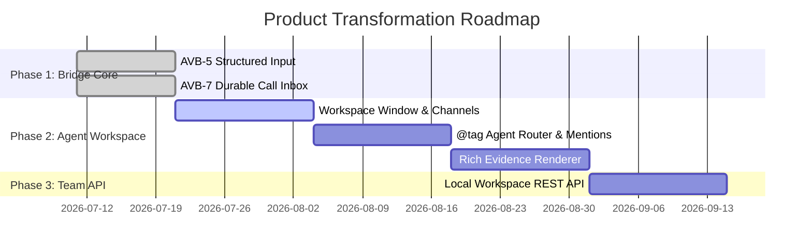

# `speak` — The Slack-Inspired Human-Agent Workspace

> **Strategic Direction & Vision document (2026-07-21)**
> **Destination**: Transform `speak` from a local voice dictation & attention tool into the **day-to-day local-first human workspace for managing multi-agent teams**.

---

## 1. Executive Summary & Core Concept

While `speak` began as an on-device voice dictation tool (matching and beating Wispr Flow on privacy, speed, and cost), dictation is only the **input tier** of a much larger product transformation. 

The next frontier for `speak` is becoming the **primary daily driver for software engineers and knowledge workers to collaborate with teams of AI agents**.

Taking inspiration from **Slack**, `speak` evolves into a **Channel-Based, Multi-Agent Workspace** running 100% locally on macOS, powered by local MCP, native APIs, and structured agent communication:

```text
┌────────────────────────────────────────────────────────────────────────────────────────┐
│  SPEAK WORKSPACE (Slack-Inspired Local Human-Agent Canvas)                             │
├─────────────────┬──────────────────────────────────────────────────────────────────────┤
│  CHANNELS       │  # feature-voice-out (Agent Team: Speech & Audio Dev)               │
│  🔒 # core-engine│ ──────────────────────────────────────────────────────────────────── │
│  💬 # qa-e2e    │  🤖 @builder-audio: I've updated AudioCapture.swift with tap guard.  │
│                 │     📸 [Evidence: AudioWaveformRender.png]                           │
│  DIRECT MESSAGES│                                                                      │
│  👤 @codex      │  👤 @tamil (via Voice Turn): "@builder-qa run `make test` & show diff"│
│  🤖 @claude-code│                                                                      │
│  🤖 @builder-qa │  🤖 @builder-qa: Tests green (269 passed).                             │
│                 │     📹 [Evidence: test_run_recording.mp4]                            │
│                 │     📄 [Diff Log: test_diff.patch]                                   │
└─────────────────┴──────────────────────────────────────────────────────────────────────┘
```

---

## 2. Product Evolution & Pillars

### Pillar 1: Channels, Threads & Context Workspaces
- **Channels as Project / Domain Scopes**: Organize work into `#feature-x`, `#architecture`, `#qa-regressions`, or `#bugs`.
- **Threaded Conversations**: Each agent turn or human voice input starts a thread. Discussions stay organized, prevent context collapse, and isolate task memory.
- **Durable History (SQLite)**: Every channel, message, thread, and evidence item is stored in local, searchable, exportable SQLite DB (`~/Library/Application Support/speak/workspace.sqlite`).

### Pillar 2: `@tag` Mention System (Directing Agents)
- **Agent Mentions (`@agent`)**: In any channel, the user can press the hotkey, speak naturally, and tag specific agents:
  - *"@codex please refactor the AudioCapture tap guard"*
  - *"@claude-code check the lint failures in `SpeakCore`"*
  - *"@builder-qa run the test suite and verify moat rules"*
- **Agent-to-Agent Mentions**: Agents can `@tag` peer agents across channels (e.g. `@builder-engine` tagging `@builder-qa` for validation) with full delivery receipts.

### Pillar 3: Rich Media Evidence (Images, Video, Audio)
- Agents do not just reply with plain text; they present **Rich Evidence Blocks**:
  1. **Image Snapshots (📸)**: UI screenshots, visual mockups, diagram renders, diff previews.
  2. **Video Recordings (📹)**: Short screen recordings showing a test case or UI interaction executing live.
  3. **Audio Artifacts (🎙️)**: Spoken voice readback, dictation audio snippets, or synthesized summary clips.
  4. **Code & Patch Diffs (📄)**: Collapsible, syntax-highlighted diffs and execution logs.

### Pillar 4: Multi-Agent Team Management
- **Single Developer, Multiple Agent Teams**: 
  - Manage specialized subagent teams (e.g., Engine Team, QA Team, Frontend Team, Audio Team).
  - Inspect agent statuses live in the sidebar: `idle`, `working`, `blocked`, `needsApproval`.
- **Local Inbox & Call Store (`AVB-7`)**: Pending agent questions, approvals, or blocker alerts land in a unified **Agent Inbox** with urgency indicators (`low`, `normal`, `high`).

### Pillar 5: Pluggable Communication Layer (MCP + APIs)
- **Model Context Protocol (MCP)**: Local stdio transport allowing Codex, Claude Code, Antigravity, and custom agent daemons to plug into `speak` seamlessly.
- **Native Webhook / HTTP REST API**: Local HTTP/WebSocket server (`localhost:8765`) enabling external tools, CI scripts, or cloud agent adapters to register sessions and send events.

---

## 3. Two-Screen Desktop Architecture

To make `speak` the daily driver without cluttering the screen:

1. **Screen Overlay & Pip Pet (Compact Mode)**:
   - Floating, non-activating panel (breathes with mic activity, shows partial transcription streaming, handles quick double-tap voice inputs).
2. **Workspace Window (Full Mode)**:
   - Full Slack-style window with Sidebar (Channels, DMs, Agent Teams), Thread Canvas, Rich Evidence Viewer, and Agent Inbox.

---

## 4. Phased Engineering & Product Roadmap



### Next Implementation Steps
1. **Phase 2.1 — Workspace Window Shell (`Speak/App/Workspace/`)**:
   - Implement the two-column sidebar + message list SwiftUI canvas.
2. **Phase 2.2 — Mention & Intent Parser (`@tag`)**:
   - Extend `VoiceCommandParser` to recognize `@agent` handles from spoken dictation.
3. **Phase 2.3 — Evidence Block Payload**:
   - Add media attachments (`imagePath`, `videoPath`, `diffContent`, `audioPath`) to `AgentEvent` and `AgentCall`.

---

## 5. Security & Moat Commitments

- **100% Local First**: Channels, threads, evidence media, and history stay on-device (`sqlite3` + local file storage).
- **No Third-Party Cloud Dependency**: Local Apple Silicon acceleration (`SpeechAnalyzer` + `Foundation Models` + local MCP).
- **Write-Only Pasteboard & Permission Isolation**: Agents never get ambient mic or screen access; every action is bounded, visible, and user-approved.
